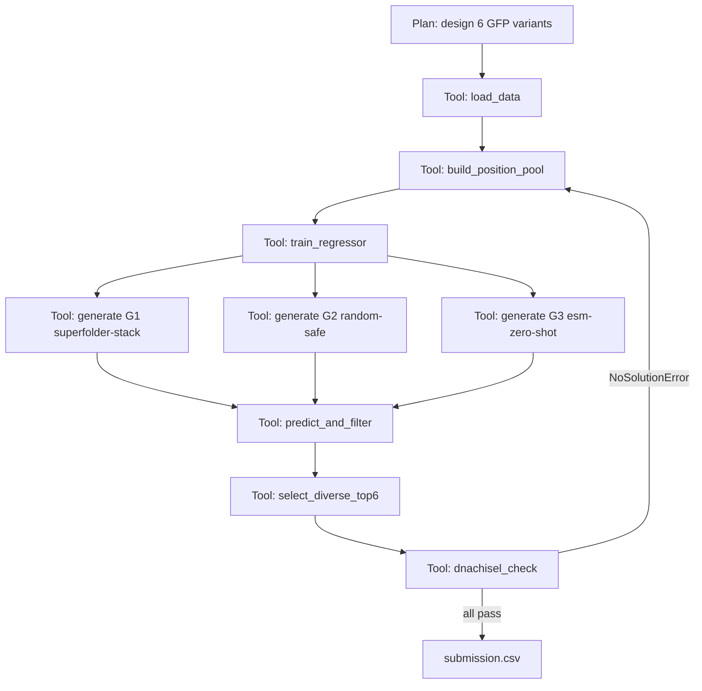

# 2026 合成生物学创新赛 · GFP Protein Design 参赛指南

> 目标：用计算方法设计 6 条 GFP 突变序列，最大化 **相对亮度 × 热稳定性** 的乘积，并确保最高分序列（Top-1）尽可能高，争取金奖、最佳亮度、最佳热稳定 3 个荣誉之一。

---

## 0. TL;DR（先读这一段就够开工）

- **打分公式**：单条得分 `S = (Finitial / Finitial_WT) × (Ffinal / Finitial)`，等价于 `S = Ffinal / Finitial_WT`，**热处理后亮度相对 WT 的比值**才是真正决定胜负的。
- **致命红线**：`Finitial < 0.3 × Finitial_WT` 的序列直接 0 分。所以「先保活，再求强」。
- **打榜规则**：6 条里取 **Top-1 排名**。⇒ 6 条要做"梯度组合"，绝不能孤注一掷做 6 条同款。
- **核心思路**：在已知最稳/最亮的 GFP（sfGFP / TGP / mBaoJin / StayGold）之上做 **保守而精准**的突变设计；用 ESM/SaProt + 回归模型筛选；用结构/文献先验约束突变位点；用 DnaChisel 在本地复现"反向翻译"流程，提前规避合成失败风险。
- **必交三件套**：
  1. `submission.csv`（6 条 AA 序列，220–250 aa，M 开头）
  2. 设计思路 PDF（含 LLM Agent 逻辑树、关键日志）
  3. 公开 GitHub 仓库（README 写清复现方式）

---

## 1. 比赛规则核心解读

### 1.1 任务

设计 6 条 GFP 突变序列（可以从零，也可以基于任意 GFP 家族优化）。组织方会用 **Cell-Free Protein Synthesis（CFPS）** 体系合成、表达，测量两轮亮度：

- `Finitial`：体外合成后立即测的亮度 → 反映**折叠效率 + 消光系数 + 量子产率**。
- `Ffinal`：在 **72 °C** 高温处理后再测的亮度 → 反映**结构稳定性、抗变性能力**。

### 1.2 公式简化

```
单条得分 = (Finitial / Finitial_WT) × (Ffinal / Finitial)
        = Ffinal / Finitial_WT     ← 真正的目标函数
```

**重要洞察**：
- 表面是亮度×稳定性，**实质是"高温后亮度的绝对水平"**。
- 任何"亮度极高但 72 °C 一把炸没"的设计，得分会极低。
- 反过来，"WT 的 80 % 亮度但热处理后还能保留 90 %"的序列，得分 ≈ 0.72×WT，可能反超激进型设计。

### 1.3 硬约束（必须满足，否则直接淘汰）

| 项目 | 限制 |
| --- | --- |
| 长度 | 220 ≤ len ≤ 250 aa |
| 起始 | 必须以 `M` 开头 |
| 字符 | 仅 20 种标准氨基酸大写，**不能含 `*` 或标点** |
| 数量 | ≤ 6 条 |
| 重复 | 不能与 `Exclusion_List.csv` 中任意一条**完全相同** |
| 表头 | `Team_Name, Seq_ID, Sequence` 三列严格对齐 |
| 隐性红线 | `Finitial < 0.3 × Finitial_WT` → 该条 0 分 |

### 1.4 奖项规则

- **打榜**：6 条中得分最高的 1 条决定全队排名（前 30 % 金奖）。
- **单项荣誉**：最佳亮度奖（Finitial 最高）、最佳热稳定奖（Ffinal/Finitial 最高）。
- **附加加分**：思路新颖、技术前沿、开源完整 → 评审在客观分相近时优先宣传。

---

## 2. 已有资源清单

| 路径 | 用途 |
| --- | --- |
| `demands/rules.txt` | 比赛规则原文 |
| `2026Protein Design_20260511/2026Protein Design/2026Protein Design in Synbio challenges.pdf` | 官方赛事说明 |
| `…/AAseqs of 5 GFP proteins_20260511.txt` | 5 条参考 WT 序列：**sfGFP、avGFP、amacGFP、cgreGFP、ppluGFP**（含推荐 PDB） |
| `…/GFP_data.xlsx` | 历史突变-亮度训练数据（`brightness` sheet，含 `aaMutations`、`Brightness`、`GFP type` 等列；`avGFP` 数据量最大） |
| `…/Exclusion_List.csv` | ~13.5 万条禁用序列，提交前需逐条比对 |
| `…/submission_template.csv` | 提交模板（表头规范） |
| `…/Basic Tutorial on Protein Design.ipynb` | 官方基线教程（ESM2 + Random Forest + 候选池随机突变） |
| `…/referencepaper/superfolder.pdf` | sfGFP 关键稳定性突变（**F64L、S65T、V163A、S175G、I167T、R80Q、N149K、M153T、A206V**） |
| `…/referencepaper/Staygold.pdf` | 抗光漂白、二聚体稳定 |
| `…/referencepaper/mBaoJin.pdf` | 单体高亮 GFP 设计经验 |
| `…/referencepaper/TGP.pdf` | 极端热稳定、非聚集 GFP（重点抄它的稳定策略） |
| `…/referencepaper/nature-Local fitness landscape of the green fluorescent protein.pdf` | **Sarkisyan 2016**，avGFP 单点/双点突变 fitness landscape，是 `GFP_data.xlsx` 的来源 |
| `tools/DnaChisel/` | 反向翻译 + 序列约束优化库（赛事用它把 AA 翻译成 DNA 模板）|

> 论文不必逐字精读，按下表"目标式速读"即可：
> - **超亮 / 折叠** → mBaoJin、StayGold、Local fitness landscape
> - **超稳 / 抗 72 °C** → TGP、Superfolder
> - **数据先验** → Local fitness landscape（直接告诉你 avGFP 哪些位点突变安全 / 致死）

---

## 3. 整体策略选型

| 路线 | 风险 | 回报 | 适合人 |
| --- | --- | --- | --- |
| **A. sfGFP / TGP 母本 + 文献已验证突变叠加**（保守稳健） | 低 | 中-高 | 所有人 ⭐ |
| **B. 多 WT 共识 / mBaoJin 启发的工程化母本** | 中 | 中-高 | 有阅读论文+数据分析能力 |
| **C. ESM/ProteinMPNN 大模型从零生成 + 回归筛选** | 高 | 高（也可能 0 分） | 有 GPU 与时间打磨 |
| **D. 混合策略：6 条按风险梯度排布**（推荐） | 综合 | **最高** | **所有打榜队** ⭐⭐⭐ |

> **推荐策略 D**：因为打榜只看 Top-1，**多样性与保险并存** 比 6 条同质化更划算。建议：
>
> | 槽位 | 母本 | 思路 | 期望 | 风险 |
> | --- | --- | --- | --- | --- |
> | Seq_1 | **sfGFP**，最少改动（1–2 个文献验证的稳定突变） | 保底 | S ≈ 0.9–1.0 | 极低 |
> | Seq_2 | **sfGFP** + 全部 superfolder 突变 + 1–2 个 TGP 同源稳定位点 | 稳态进攻 | S ≈ 1.0–1.4 | 低 |
> | Seq_3 | **TGP / mBaoJin 母本**（先确认长度与字符合规）+ 微调 | 单项最佳热稳定的"狙击枪" | S 不一定高，但 Ffinal/Finitial 极高 | 中 |
> | Seq_4 | **avGFP 母本** + ESM 回归 Top-K（限制在数据集"安全位点"） | ML 探索 | S ≈ 0.8–1.3 | 中 |
> | Seq_5 | **sfGFP 母本** + ProteinMPNN/ESM-IF 设计的 ≤6 个突变（结构保守） | 进攻 | S ≈ 0.8–1.5 | 中-高 |
> | Seq_6 | **共识序列 / 多 WT 拼接** 或最大胆的设计 | 高风险高收益 | 大概率 < 0.3 被淘汰，但中了就是金奖 | 高 |
>
> 这样 Seq_1/Seq_2 兜底拿银，Seq_3 冲单项荣誉，Seq_4–6 冲金。Top-1 由概率最高的 Seq_5 / Seq_2 给出。

---

## 4. 参考文献"30 秒速读"——直接告诉你能抄什么

| 论文 | 关键收获（直接拿来用） |
| --- | --- |
| **Superfolder GFP**（superfolder.pdf） | 在 avGFP 上叠加 `S30R, Y39N, F64L, S65T, F99S, N105T, Y145F, M153T, V163A, I171V, A206V` 中任意子集即可大幅提升折叠效率与热稳定性。**这是最便宜的高收益突变包**。 |
| **TGP**（TGP.pdf） | 来自 *Galdieria* 的 GFP 同源蛋白，72 °C 仍稳定、不聚集 → 可直接选 TGP 作母本（注意长度合规）。也可把它"独有的稳定位点"嫁接到 sfGFP 同源位置。 |
| **StayGold** | 二聚体高量子产率、抗光漂白；其单体化突变（A206K 之类）经验值得参考。 |
| **mBaoJin** | 单体化高亮 GFP，工程化思路：从 cgreGFP 出发的"亮度+折叠"双优化范例。 |
| **Sarkisyan 2016**（nature local fitness landscape） | **GFP_data.xlsx 的来源**。可直接用它统计：哪些位点被多次"good 突变"覆盖（≈ permissive sites），哪些是"绝对致死位点"。这是构造 `candidate_position_pool` 的金标准。 |

---

## 5. 详细执行计划（建议 7–10 天）

### Day 0：环境与代码骨架

- 在 `ProteinDesign/` 仓库下创建：

```
ProteinDesign/
├── README.md                     # 复现说明
├── 参赛指南.md                    # 本文件
├── data/                         # 软链或副本：GFP_data.xlsx、Exclusion_List.csv、AAseqs...
├── refs/                         # WT FASTA、PDB
├── src/
│   ├── 00_load_and_clean.py      # 数据清洗（参考 notebook 第 2 步）
│   ├── 01_position_pool.py       # 文献+数据驱动构造突变位点池
│   ├── 02_embed_esm.py           # ESM2/SaProt 嵌入
│   ├── 03_train_regressor.py     # RF / GBDT / Ridge 回归
│   ├── 04_generate_candidates.py # 候选生成（多策略）
│   ├── 05_predict_and_rank.py    # 综合打分、排除名单过滤
│   ├── 06_select_top6.py         # 多样性挑选（含 6 条梯度策略）
│   ├── 07_dnachisel_check.py     # 本地反向翻译 + 合成可行性自检
│   └── utils.py
├── notebooks/
│   └── exploration.ipynb         # 复用官方 Tutorial
├── outputs/
│   ├── candidates_raw.csv
│   ├── ranked.csv
│   └── submission.csv
├── docs/
│   ├── design_doc.md             # 设计思路（最终导出 PDF）
│   └── agent_log.md              # LLM Agent 逻辑树+关键日志
├── env/
│   └── environment.yml / requirements.txt
└── .gitignore
```

- 推荐 conda 环境（GPU 版）：

```bash
conda create -n proteindesign python=3.10 -y
conda activate proteindesign
pip install fair-esm transformers sentencepiece torch \
            scikit-learn pandas numpy openpyxl biopython \
            tqdm matplotlib seaborn
pip install -e ./tools/DnaChisel    # 直接用本地 DnaChisel
```

> 没有 GPU 时把 `esm2_t30_150M_UR50D` 换成 `esm2_t6_8M_UR50D`，并把训练样本数从 5000 降到 1500–2000。

### Day 1：数据理解 + WT 校准

1. 用 pandas 读 `GFP_data.xlsx` 的 `brightness` sheet，确认：
   - 列名（`aaMutations`、`Brightness`、`GFP type` 等）
   - 各 GFP 类型样本数
   - WT 行（`aaMutations == 'WT'`）的 `Brightness` 数值，记为基线
2. 用 `AAseqs of 5 GFP proteins_20260511.txt` 把 5 条 WT 序列 dump 为单独 FASTA。
3. **长度合规预检**：把这 5 条 + sfGFP 全部测一下 `len`，确认 220 ≤ len ≤ 250：
   - sfGFP / avGFP / amacGFP 大约 238 aa，**安全**。
   - cgreGFP / ppluGFP / mBaoJin / StayGold / TGP 需要单独确认（特别注意 ppluGFP 219 aa 可能差一位）。
4. 把所有 5 条 WT 都放进 `Exclusion_List.csv` 做一次比对，避免不小心提交 WT。

### Day 2：构造高质量"候选位点池"

`candidate_position_pool` 的质量决定一切，**别用官方教程那 22 个示例位点**。建议用以下三股信息合并：

- **A. 文献先验**（Superfolder/StayGold/TGP/mBaoJin 中报道过的稳/亮位点）→ 高权重。
- **B. 数据驱动**：
  - 对 `avGFP` 单点突变，按 `Brightness > 1.5 × WT_Brightness` 筛"增益位点"。
  - 用 `groupby` 找在多条高分突变体中反复出现的位点。
  - 排除"绝对致死位点"：`Brightness < 0.05 × WT` 出现频率 > 80 % 的位点列入禁区。
- **C. 结构先验**：用 PyMOL/Biopython 加载 PDB（sfGFP 推荐 2B3P），筛选：
  - 远离生色团（Y66 周围 8 Å）的表面残基 → 突变安全。
  - 紧邻发色团但已有文献验证的"调谐位"（如 64、65、203、205）→ 影响光谱性质，慎重。
  - β-barrel 内核疏水残基 → **不要乱动**。

最终位点池建议 30–60 个，区分 `safe_pool`（保活）/ `tuning_pool`（调谱）/ `risky_pool`（实验区）。

### Day 3：回归模型训练（亮度预测器）

1. **特征**：用 ESM2 序列嵌入（`esm2_t30_150M_UR50D` 优先；CPU 用 `esm2_t6_8M_UR50D`）。Mean-pool 残基级嵌入到序列级。
2. **数据**：`GFP_data.xlsx` 的 `avGFP` 子集（数据量最大）。
3. **模型 baseline**：Random Forest（官方教程已有），R² 期望 0.4–0.55。
4. **进阶**：
   - GBDT (`lightgbm.LGBMRegressor`) 通常比 RF 高 0.05 R²。
   - Ridge / ElasticNet 作为线性 baseline（用于看嵌入是否有信号）。
   - 用 `KFold(5)` 评估，避免单次 split 过拟合。
5. **关键改进**（拉开差距的地方）：
   - **位点级残差特征**：除整序列嵌入外，把"突变位点周围 ±3 残基"嵌入再 mean-pool 拼接。
   - **零样本得分**：直接用 ESM 的 log-likelihood（mutation effect score）作为额外特征 / 第二打分维度。
   - **多任务**：除亮度外，如果有公开热稳定数据（如 ProThermDB / Tm 数据集），可训练第二个稳定性预测头，用于挑选 Seq_3。

### Day 4：候选生成（多策略并行）

为每条最终序列准备**独立的候选池**，避免互相污染：

#### 策略 G1：文献增量（保底用）
- 母本：sfGFP。
- 操作：从 superfolder 11 个突变中"贪心叠加"，每加 1 个跑回归预测，保留预测亮度↑的组合。

#### 策略 G2：数据驱动 1–6 点突变
- 母本：avGFP（与训练集分布一致）。
- 操作：从 `safe_pool` 随机抽 1–6 个位点，每个位点选 19 种 AA → 总数控制在 5000–20000；预测后取 Top-K（K = 200）。

#### 策略 G3：ESM zero-shot 引导
- 思路：对 sfGFP 在每个位点跑 ESM `predict_masked_token`，统计每个位点的 logits，挑选"模型给高分但与 WT 不同"的位点和 AA。

#### 策略 G4：ProteinMPNN（可选，加分项）
- 用 sfGFP 的 PDB 做 **fixed-backbone 序列设计**，限定要求"≤6 个位点偏离 WT 且不动 65–67 生色团残基"。
- 输出几百条候选，再灌进 G2/G3 同样的回归打分。

#### 策略 G5：TGP/mBaoJin 直接微调
- 母本就用论文里那条新颖蛋白（如果长度合规），改 1–2 个位点应对预测器（避免和已知专利序列完全相同）。

### Day 5：综合排序、排除过滤与多样性挑选

1. 把 G1–G5 全部候选统一打分：

   ```
   score = α × predicted_brightness_z          # ML 预测亮度 (z-score)
         + β × stability_proxy                 # 文献+TGP 同源加分 + ESM-IF 结构能 (可选)
         - γ × novelty_penalty                 # 与 Exclusion_List 的最近距离过近时惩罚
         + δ × esm_zero_shot                   # ESM mutation effect
   ```

   推荐起步权重：α=1.0，β=0.5，γ=0，δ=0.3，后续按校验集调整。

2. **逐条**与 `Exclusion_List.csv` 做精确字符串比对（用 `set` 加速）。
3. **逐条**做硬约束检查：长度 ∈ [220,250]、首字符 = `M`、字符集 ⊆ 20 AA。
4. **多样性挑选**：使用 6 槽位策略（见 §3 的表）：
   - 在每个槽位的"专属候选池"里挑预测分最高且**与已选过序列编辑距离 ≥ 3** 的那一条；
   - 编辑距离防止 6 条挤在同一族，输出对评审而言也更有说服力。

### Day 6：本地"模拟提交"+ DnaChisel 自检

虽然组织方会用 DnaChisel 反向翻译，但你**自己也要跑一遍**，以提前暴露任何"AA 合规但 DNA 端会触发禁忌"的风险（罕见密码子、限制酶切位点、发卡结构）：

```python
# src/07_dnachisel_check.py（思路片段）
from dnachisel import (DnaOptimizationProblem, EnforceTranslation,
                       AvoidPattern, EnforceGCContent, CodonOptimize,
                       reverse_translate)

aa_seq = "M..."  # 你的某条候选
# 1) 朴素反向翻译
dna = reverse_translate(aa_seq, table='Standard')

# 2) 用大肠杆菌密码子表 + GC 30-70 % + 常见限制酶位点过滤再优化一次
problem = DnaOptimizationProblem(
    sequence=dna,
    constraints=[
        EnforceTranslation(),
        EnforceGCContent(mini=0.30, maxi=0.70, window=50),
        AvoidPattern("BsaI_site"),
        AvoidPattern("BsmBI_site"),
        AvoidPattern("EcoRI_site"),
    ],
    objectives=[CodonOptimize(species="e_coli")],
)
problem.resolve_constraints()
problem.optimize()
print(problem.constraints_text_summary())
print(problem.objectives_text_summary())
```

- **如果 `resolve_constraints` 抛 `NoSolutionError`**：说明这条 AA 序列在 DNA 端会让赛事 pipeline 难产，建议替换或微调。
- **GC 异常 / CAI 偏低** → 该 AA 序列在 CFPS 体系里翻译效率可能受影响，直接影响 `Finitial`，提前换掉。

### Day 7：交付物制作

1. **`submission.csv`**（严格按官方模板）：

```csv
Team_Name,Seq_ID,Sequence
YourTeamName,1,MSKGEELFTGVVPILVELDGDVNGHKFSV...（完整序列，220–250 aa）
YourTeamName,2,MSKGEELFTGVVPILVELDGDVNGHKFSV...
...
YourTeamName,6,MSKGEELFTGVVPILVELDGDVNGHKFSV...
```

2. **`docs/design_doc.md` → 导出 PDF**，建议章节：
   - 摘要与最终 6 条序列一览（一张表）
   - 总体策略与 6 条序列的"风险梯度"理由
   - 数据预处理与位点池构造方法
   - 模型管线（ESM/SaProt + 回归）+ 验证集 R²
   - 候选生成 5 条策略 G1–G5 的对比
   - 多目标排序公式与权重
   - LLM Agent 逻辑树 + 关键日志（用 mermaid 画）
   - 复现说明（命令行级别）
   - 引用文献

3. **`README.md`**（仓库根目录，评审会先看这个）：
   - 一段话项目介绍
   - 环境配置（`conda env create -f env/environment.yml`）
   - 数据放置位置
   - 复现命令（`python src/00_load_and_clean.py` … `python src/06_select_top6.py`）
   - 输出文件说明
   - License（MIT 即可）

---

## 6. 关键代码骨架（可直接复制）

> 把以下文件放进 `src/`，按顺序运行即可获得 `outputs/submission.csv`。所有路径建议通过一个 `config.yaml` 集中管理。

### 6.1 `src/utils.py`

```python
from pathlib import Path
import pandas as pd

AA20 = "ACDEFGHIKLMNPQRSTVWY"

def load_wt_fasta(path: str | Path) -> dict[str, str]:
    """解析 AAseqs of 5 GFP proteins_20260511.txt 形式的 FASTA。"""
    seqs, header = {}, None
    for line in Path(path).read_text(encoding="utf-8").splitlines():
        line = line.strip()
        if not line or line.startswith("#"):
            continue
        if line.startswith(">"):
            header = line[1:].split()[0]
            seqs[header] = []
        elif header is not None:
            seqs[header].append(line)
    return {k: "".join(v) for k, v in seqs.items()}

def is_valid_submission(seq: str) -> tuple[bool, str]:
    if not seq or seq[0] != "M":
        return False, "must start with M"
    if not 220 <= len(seq) <= 250:
        return False, f"length={len(seq)} out of [220,250]"
    if any(c not in AA20 for c in seq):
        return False, "contains non-AA20 char"
    return True, "ok"

def load_exclusion_set(path) -> set[str]:
    df = pd.read_csv(path)
    col = df.columns[0]            # 教程里叫 'sequences-not-submit'，新版可能直接叫 'Sequence'
    return set(df[col].astype(str).str.strip())
```

### 6.2 `src/01_position_pool.py`（核心：位点池构造）

```python
import pandas as pd, re
from collections import Counter

GFP_DATA = "data/GFP_data.xlsx"
WT_NAME = "avGFP"

df = pd.read_excel(GFP_DATA, sheet_name="brightness")
df = df[df["GFP type"] == WT_NAME].dropna(subset=["aaMutations", "Brightness"])

wt_brightness = df.loc[df["aaMutations"].str.upper() == "WT", "Brightness"].mean()

def parse(mut_str):
    return re.findall(r"([A-Z])(\d+)([A-Z])", str(mut_str))

# A. 增益位点统计
gain_pos, lethal_pos = Counter(), Counter()
for _, row in df.iterrows():
    rel = row["Brightness"] / wt_brightness
    for _, pos, _ in parse(row["aaMutations"]):
        pos = int(pos)
        if rel > 1.2:
            gain_pos[pos] += 1
        elif rel < 0.05:
            lethal_pos[pos] += 1

# B. 文献先验（superfolder 突变 1-based）
literature_pos = {30, 39, 64, 65, 99, 105, 145, 153, 163, 171, 206}

# C. 合并并去除致死位点
top_data = {p for p, c in gain_pos.most_common(40)}
forbidden = {p for p, c in lethal_pos.items() if c > 5}

safe_pool   = sorted((literature_pos | top_data) - forbidden)
print(f"safe positions ({len(safe_pool)}):", safe_pool)
pd.Series(safe_pool, name="position_1based").to_csv(
    "outputs/safe_positions.csv", index=False)
```

### 6.3 `src/04_generate_candidates.py`（多策略候选生成）

```python
import random, json, itertools
from utils import AA20, is_valid_submission

random.seed(42)

WT = open("refs/sfGFP.fasta").read().splitlines()[1]   # 跳过 >header

# === 策略 G1：贪心叠加 superfolder 突变 ===
SUPERFOLDER = {
    30: ("S", "R"), 39: ("Y", "N"), 64: ("F", "L"), 65: ("S", "T"),
    99: ("F", "S"), 105: ("N", "T"), 145: ("Y", "F"), 153: ("M", "T"),
    163: ("V", "A"), 171: ("I", "V"), 206: ("A", "V"),
}
def apply(seq, mutations):
    s = list(seq)
    for pos, (orig, new) in mutations.items():
        if s[pos-1] == orig:
            s[pos-1] = new
    return "".join(s)

# === 策略 G2：从安全池随机 1-6 点突变 ===
import pandas as pd
safe_pool = pd.read_csv("outputs/safe_positions.csv")["position_1based"].tolist()

def random_candidate(seq, pool, max_mut=6):
    n = random.randint(1, max_mut)
    sites = random.sample(pool, n)
    s = list(seq)
    muts = []
    for p in sites:
        orig = s[p-1]
        new = random.choice([a for a in AA20 if a != orig])
        s[p-1] = new
        muts.append(f"{orig}{p}{new}")
    return "".join(s), ":".join(sorted(muts, key=lambda x: int(x[1:-1])))

candidates = []
candidates.append((apply(WT, SUPERFOLDER), "superfolder_full"))
for _ in range(20000):
    seq, mut = random_candidate(WT, safe_pool, 6)
    ok, _ = is_valid_submission(seq)
    if ok:
        candidates.append((seq, mut))

# 去重 + 落盘
unique = {seq: mut for seq, mut in candidates}
pd.DataFrame([{"Sequence": s, "Mutations": m} for s, m in unique.items()]) \
  .to_csv("outputs/candidates_raw.csv", index=False)
print(f"Generated {len(unique)} unique candidates.")
```

### 6.4 `src/05_predict_and_rank.py`（嵌入 + 预测 + 过滤）

```python
import pandas as pd, numpy as np, joblib
import torch, esm
from utils import load_exclusion_set, is_valid_submission

DEVICE = "cuda" if torch.cuda.is_available() else "cpu"
MODEL_NAME = "esm2_t30_150M_UR50D" if DEVICE == "cuda" else "esm2_t6_8M_UR50D"

def embed(seqs, batch=8):
    model, alphabet = esm.pretrained.load_model_and_alphabet(MODEL_NAME)
    model.eval().to(DEVICE)
    bc = alphabet.get_batch_converter()
    out = []
    with torch.no_grad():
        for i in range(0, len(seqs), batch):
            data = [(f"s{j}", s) for j, s in enumerate(seqs[i:i+batch])]
            _, _, toks = bc(data); toks = toks.to(DEVICE)
            res = model(toks, repr_layers=[model.num_layers])
            rep = res["representations"][model.num_layers]
            for j, s in enumerate(seqs[i:i+batch]):
                out.append(rep[j, 1:len(s)+1].mean(0).cpu().numpy())
    return np.vstack(out)

cand = pd.read_csv("outputs/candidates_raw.csv")
X = embed(cand["Sequence"].tolist())
rf = joblib.load("outputs/rf_model.joblib")        # 由 03_train_regressor.py 训练好
cand["pred_brightness"] = rf.predict(X)

# 过滤
excl = load_exclusion_set("data/Exclusion_List.csv")
cand = cand[~cand["Sequence"].isin(excl)]
cand = cand[cand["Sequence"].apply(lambda s: is_valid_submission(s)[0])]
cand = cand.sort_values("pred_brightness", ascending=False)
cand.to_csv("outputs/ranked.csv", index=False)
print("Top 10:\n", cand.head(10)[["pred_brightness", "Mutations"]])
```

### 6.5 `src/06_select_top6.py`（多样性 + 风险梯度）

```python
import pandas as pd, numpy as np

def hamming(a, b): return sum(x != y for x, y in zip(a, b))

ranked = pd.read_csv("outputs/ranked.csv")
selected = []
MIN_DIST = 3      # 已选序列间最小汉明距离

for _, row in ranked.iterrows():
    if all(hamming(row["Sequence"], s) >= MIN_DIST for s in selected):
        selected.append(row["Sequence"])
    if len(selected) == 6:
        break

sub = pd.DataFrame({
    "Team_Name": ["YourTeamName"] * 6,
    "Seq_ID": list(range(1, 7)),
    "Sequence": selected,
})
sub.to_csv("outputs/submission.csv", index=False)
print("Saved outputs/submission.csv")
```

> 上面 6 条直接来自 ranked。如果你按 §3 的"风险梯度策略"，需要把不同策略的候选分别保存（如 `ranked_G1.csv`、`ranked_G3.csv` …），然后从每个池子里挑 1–2 条，再做汉明距离去重。

---

## 7. 提交前自检清单（每条都要 ✅）

- [ ] CSV 表头严格为 `Team_Name,Seq_ID,Sequence`，无多余空格 / BOM。
- [ ] 共 6 行数据（不是 7 行）。
- [ ] 每条序列长度 ∈ [220, 250]。
- [ ] 每条序列首字符 = `M`。
- [ ] 每条序列字符 ⊆ `ACDEFGHIKLMNPQRSTVWY`（无 `*`、空格、小写、`X` 等）。
- [ ] 6 条序列两两不同。
- [ ] 6 条序列没有任何一条与 `Exclusion_List.csv` 完全相同。
- [ ] 6 条序列没有一条与 5 条 WT 完全相同（排除把 sfGFP 直接当 Seq_1 提交的低级错误）。
- [ ] DnaChisel 反向翻译 + 约束求解全部通过（无 `NoSolutionError`）。
- [ ] 至少 1 条序列做了"保守保底"——预测亮度 ≥ 0.5 × WT。
- [ ] GitHub 仓库 README 写清复现命令；环境文件可装；模型权重 / 大数据集走 `.gitignore` 或 Git LFS。
- [ ] 设计思路 PDF 包含 LLM Agent 逻辑树（mermaid 截图即可）和关键日志摘录。

---

## 8. LLM Agent 用法建议（赛事鼓励、加分项）

赛规明确提到"鼓励使用大模型与代码 Agent，需展示逻辑树和关键执行日志"。建议：

- **Agent 编排**：把上面 7 个 src 脚本作为"工具节点"，让 Cursor/Claude/GPT 充当总控：
  1. `analyze_data` → 给出位点池建议
  2. `train_model` → 报告 R²
  3. `generate_candidates(strategy=G1..G5)` → 写入候选池
  4. `predict_and_filter` → 输出 ranked.csv
  5. `select_diverse_top6` → 写入 submission
  6. `validate_submission` → 跑 §7 自检
  7. `dnachisel_check` → 反向翻译
- **逻辑树**：用 mermaid 在 `docs/agent_log.md` 中画出工具调用链；
- **关键日志**：每一步保存 `logs/{step}_{timestamp}.log`，PDF 中节选高信息密度行。

示例 mermaid 片段（直接放进 PDF）：



---

## 9. 风险点与避坑指南

| 风险 | 触发场景 | 规避 |
| --- | --- | --- |
| **0 分淘汰** | `Finitial < 0.3 × WT` | Seq_1/2 必须保守；任何大于 6 个突变的设计要做 ESM zero-shot 二次校验 |
| **撞名禁用列表** | Top-K 太集中、与已知突变体重合 | 提交前对 6 条都做精确比对；同时检查与 5 条 WT 不重 |
| **长度越界** | TGP / mBaoJin 等天然较短或较长的母本 | Day 1 就先 `len()` 校验；必要时在 N/C 端补 GS-linker（注意仍要 220–250） |
| **包含非 AA20 字符** | 复制论文序列时混进 `*` 或非 ASCII | 用 `is_valid_submission` 自动校验 |
| **DNA 反向翻译失败** | 含罕见密码子或限制酶位点 | DnaChisel 本地预跑；失败的 AA 序列改 1–2 个同义氨基酸 |
| **模型过拟合** | RF R² 在训练集 0.9，在验证集 0.3 | 用 `KFold(5)`；限制 `max_depth`、提高 `min_samples_leaf`；提交前做"留出 WT 邻域"测试 |
| **训练数据偏 avGFP** | 在 sfGFP 上预测会有分布漂移 | 把 sfGFP-avGFP 序列差异作为特征；或仅用 avGFP 母本生成 Seq_4 这种"分布内"候选 |
| **CFPS 表达能力差** | 信号肽 / N 端 Met 后第二位是 K/R/H 等碱性残基 | 保留 sfGFP/avGFP 的 N 端"MSKGEELFTG"；除非有充分理由不要改 N 端 1–10 位 |
| **生色团破坏** | 误改 Y66 邻近 (Thr65-Tyr66-Gly67) | 把 65–67 列入硬禁区；位点池构造时显式过滤 |
| **聚集 / 不溶** | A206 等界面位点错误突变 | 单体化推荐用 `A206K`，不要随意尝试 W/F |
| **6 条同质** | 全部从同一个候选池 Top-6 直接取 | 必须做 §6.5 的汉明距离去重，或按 §3 风险梯度分槽位 |
| **GitHub 仓库被打回** | 没有 README、依赖装不上、路径硬编码 | 走 `config.yaml`；用相对路径；最后在干净环境里重跑一次 |

---

## 10. 时间表（推荐 7 天冲刺）

| 日期 | 主任务 | 产出 |
| --- | --- | --- |
| Day 0 | 环境 + 仓库脚手架 + 论文速读 | `requirements.txt`、`README.md` 草稿 |
| Day 1 | 数据清洗 + WT 校准 + 5 条 WT 长度合规检查 | `outputs/clean_avGFP.csv` |
| Day 2 | 位点池（文献 + 数据 + 结构） | `outputs/safe_positions.csv` |
| Day 3 | ESM 嵌入 + RF/LightGBM 训练 + 5-fold R² | `outputs/rf_model.joblib`、`reports/cv_metrics.md` |
| Day 4 | G1–G5 候选生成（每策略 2k–20k） | `outputs/candidates_G{1..5}.csv` |
| Day 5 | 综合排序 + Exclusion 过滤 + 多样性挑 6 条 | `outputs/ranked.csv`、`outputs/submission.csv` |
| Day 6 | DnaChisel 反向翻译自检 + 不通过的序列回炉 | `outputs/dnachisel_report.html` |
| Day 7 | 设计文档 PDF + Agent 日志整理 + GitHub 公开发布 + 最终提交 | `docs/design_doc.pdf`、提交 |

> **建议**：Day 3 之前不要碰 ProteinMPNN / 大模型微调这种"看起来高大上但收益不确定"的方向；Top-1 分数主要由"位点池质量 + 多样性挑选 + 不踩雷"决定。

---

## 11. 加分项（在客观分相近时拉开差距）

1. **可复现的开源管线**：一条 `make all` 或 `bash run.sh` 跑完整个流水线。
2. **多模型 ensemble**：ESM2 + SaProt 嵌入分别训 RF / LGBM，预测取均值；论文里写"提升验证 R² 从 0.48 → 0.55"。
3. **结构感知**：用 ESMFold 给候选打结构 pLDDT 分，作为稳定性 proxy；剔除 pLDDT < 70 的设计。
4. **不确定性量化**：RF 树间方差 / LGBM quantile，输出"高均值 + 低方差"候选优先；写进 PDF 是亮点。
5. **主动学习思路**：在文档里讨论"如果允许多轮反馈，下一批我们会怎么挑"，体现科研性。
6. **Agent 自治**：把整个流水线封装成可被 Cursor Agent 调度的脚本，附 `agent_run.log`，再现性强 → 评审会直接给宣传位。
7. **可视化**：候选预测分数分布直方图、位点贡献热图、6 条序列的突变对比图（用 logomaker 或 matplotlib）。

---

## 12. 常见 Q&A

**Q1：能直接提交 sfGFP / TGP 原文献中的最佳突变体吗？**
A：先用 §7 自检 + Exclusion_List 比对。如果不在禁用列表中，理论上可以，但**评审会发现并降低创新性评分**。建议至少在原文献突变上叠加 1–2 个"自己设计的微调"，并在 PDF 中说明动机。

**Q2：模型 R² 只有 0.3，能比赛吗？**
A：能。亮度预测器哪怕 R² 0.3，对"在 1 万条候选里挑 Top-100"已经远好于随机；最终性能更多取决于位点池质量和保底策略。

**Q3：Bohrium 平台没法用 ProteinMPNN，怎么办？**
A：跳过 G4 即可。仅靠 G1+G2+G3+G5 也能拿到不错的成绩；ProteinMPNN 是锦上添花。

**Q4：为什么不直接预测热稳定性？**
A：组织方不会公开 `Ffinal` 的训练数据；只能用代理特征（来自 TGP / superfolder 的同源稳定突变、ESMFold pLDDT、ProteinMPNN 设计能、GFP β-barrel 关键稳定残基等）。本指南把"稳定性"主要靠**文献先验**和**结构 proxy**，而不是端到端预测。

**Q5：6 条提交的顺序重要吗？**
A：从规则文本看不重要，但建议把"最保守的"放 Seq_1，"最激进的"放 Seq_6，这样审稿人扫一眼就能理解你的策略。

**Q6：DnaChisel 一定要用吗？**
A：组织方内部一定会用；你**自己跑**只是为了"提前发现合成失败 / 翻译效率低"的序列。这是质量保证步骤，**强烈建议**做。

**Q7：可以用 AlphaFold3 / ESM3 / 商业 API 吗？**
A：可以，但要注意：
- API 调用要可复现 → 把 prompt 和返回完整记录在 `logs/`；
- 不要使用闭源模型作为唯一打分器（评审无法复现）。把它们当作 ensemble 的一环，仍要保留一个开源 baseline。

---

## 14. 开源工具箱（2026 更新版）

> 按"在流水线中的位置"组织，每一项都标注了 **对 Top-1 的边际收益**（⭐ 越多越值得花时间）与 **上手难度**（🔧 越多越费劲）。一条经验：先把 ⭐⭐⭐ / 🔧 的全跑通，再考虑 ⭐⭐ / 🔧🔧 的增强模块。

### 14.1 蛋白语言模型（PLM，做嵌入特征 / 零样本打分）

| 工具 | 来源 | 用途 | 收益 | 难度 |
| --- | --- | --- | --- | --- |
| **ESM-2** | `facebookresearch/esm` (`fair-esm`) | Mean-pool 嵌入；mask token logits 做 zero-shot 突变效应 | ⭐⭐⭐ | 🔧 |
| **ESM-3** | `evolutionaryscale/esm` | 多模态（序列 + 结构 + 功能）；官方就有 **`cookbook/tutorials/3_gfp_design.ipynb`** —— **设计 esmGFP 的全流程教程**，几乎是为本赛量身定做 | ⭐⭐⭐⭐ | 🔧🔧 |
| **SaProt** | `westlake-repl/SaProt` | 把结构 token 与序列 token 混合编码；R² 通常比 ESM-2 高 0.03-0.06 | ⭐⭐ | 🔧 |
| **ProtT5** | `Rostlab/ProtTrans` | 老牌 encoder-decoder 嵌入；与 ESM 做 ensemble 能稳定增益 | ⭐⭐ | 🔧 |
| **ProGen2** | `salesforce/progen2` | 因果 PLM，做"likelihood as fitness"；对长程突变更敏感 | ⭐⭐ | 🔧🔧 |
| **ESM-IF1**（inverse folding） | 包含在 `fair-esm` | 给定主链坐标 → AA 概率；可做 zero-shot ddG 与 ProteinMPNN 互补 | ⭐⭐⭐ | 🔧🔧 |

> **打榜建议**：基线 = ESM-2 嵌入 + RF；ensemble = ESM-2 + SaProt + ProtT5（嵌入拼接或预测取均值）。如果你能跑 ESM-3 cookbook，**直接拿它的 GFP 教程做 Seq_5 / Seq_6**。

### 14.2 反向折叠 / 结构条件序列设计（生成新序列）

| 工具 | 用途 | 收益 | 难度 |
| --- | --- | --- | --- |
| **ProteinMPNN** (`dauparas/ProteinMPNN`) | 给 sfGFP 的 PDB（如 2B3P）做 fixed-backbone 重设计；可指定哪些位点 fix | ⭐⭐⭐ | 🔧🔧 |
| **LigandMPNN** (`dauparas/LigandMPNN`, *Nat. Methods* 2025) | 把生色团 CRO 当 ligand，让设计感知发色团周围 5 Å 邻居；金属/小分子位点 native recovery 比 ProteinMPNN 提升 20-40 % | ⭐⭐ | 🔧🔧🔧 |
| **ESM-IF1** (`facebookresearch/esm` 的 `esm.inverse_folding`) | 与 ProteinMPNN 同类、同 PDB 输入，输出每个位点 AA 概率；可做 zero-shot stability proxy | ⭐⭐⭐ | 🔧🔧 |
| **PiFold** (`A4Bio/PiFold`) | 基于 AAformer 的快速反向折叠，比 ProteinMPNN 快 ~10×；适合大批量"虚拟筛选" | ⭐⭐ | 🔧🔧 |

> **GFP 专用建议**：sfGFP β-barrel 已经稳定，不需要 RFdiffusion 这种"从零生骨架"的工具。**ProteinMPNN（fix 65-67 + N/C 端 + 部分核心残基）= 主力武器**；LigandMPNN 把发色团当 ligand 做 1-2 条高难度设计冲创新分。

### 14.3 结构预测（给候选打"折叠质量分"）

| 工具 | 适用 | 收益 | 难度 |
| --- | --- | --- | --- |
| **ESMFold** (`fair-esm.esmfold_v1`) | **单序列、无 MSA、秒级出结构**，最适合"对几千条候选批量出 pLDDT" | ⭐⭐⭐ | 🔧🔧 |
| **ColabFold** (`sokrypton/ColabFold`) | AlphaFold2 + MMseqs2 MSA，比官方 AF2 快 5-10×；本地或 Colab 都可跑 | ⭐⭐ | 🔧🔧 |
| **OpenFold-3** (`aqlaboratory/openfold-3`) | 完全开源的 AlphaFold3 复现，2026.3 发布 v0.4.0；支持蛋白+小分子+核酸 | ⭐⭐ | 🔧🔧🔧 |
| **Boltz-1 / Boltz-2** (`jwohlwend/boltz`) | MIT 开源，扩散模型，速度优于 AF3；GPU 友好 | ⭐⭐ | 🔧🔧🔧 |
| **Chai-1** (`chaidiscovery/chai-lab`) | Apache-2.0，多模态预测；2026.4 仍在更新；要求 A100/H100 级 GPU | ⭐⭐ | 🔧🔧🔧 |
| **ABCFold** | 一个命令行同时跑 AF3 / Boltz / Chai 并对比 | ⭐ | 🔧🔧 |

> **打榜用法**：跑 ESMFold（最快），把 6 条候选的 **pLDDT < 70** 直接淘汰；对 Top-20 候选额外跑一下 Boltz-1 取均值更稳。

### 14.4 稳定性预测（针对 72 °C 高温的 Ffinal/Finitial）

> 这是**最值得花时间的章节**，因为 GFP_data.xlsx 没有热稳定 label，组织方又恰好考热稳定。

| 工具 | 输入 | 输出 | 收益 | 难度 |
| --- | --- | --- | --- | --- |
| **ThermoMPNN** (`Kuhlman-Lab/ThermoMPNN`, MIT) | PDB + 单点突变列表 | ΔΔG (kcal/mol)；越负越稳 | ⭐⭐⭐⭐ | 🔧🔧 |
| **ThermoMPNN-D** (`Kuhlman-Lab/ThermoMPNN-D`) | 同上 + 双点突变 | 双点突变 ΔΔG，能捕获位点协同 | ⭐⭐⭐ | 🔧🔧 |
| **ProStab** (`xtanh/ProStab`) | 序列 + 结构 | ΔΔG，整合 PLM 嵌入 + ProteinMPNN 先验 | ⭐⭐⭐ | 🔧🔧 |
| **ESMStabP** | 序列 only | Tm（°C），R² 高达 0.95 | ⭐⭐⭐ | 🔧🔧 |
| **TemBERTure** (`ibmm-unibe-ch/TemBERTure`) | 序列 only | Tm 回归 + 嗜热分类 | ⭐⭐ | 🔧 |
| **DPStab / DeepTherm** (`CSUBioGroup/DPStab`) | 序列 + 结构 | ΔΔG **和** ΔTm 同时预测，正反对称约束 | ⭐⭐⭐ | 🔧🔧 |
| **DDGScan** (`JinyuanSun/DDGScan`) | PDB | 一条命令并行跑 FoldX + Rosetta cartesian_ddg + ddg_monomer | ⭐⭐ | 🔧🔧🔧 |
| **Rosetta `cartesian_ddg`** | PDB | 经典物理 ΔΔG，金标准但慢 | ⭐⭐ | 🔧🔧🔧 |
| **FoldX 5** | PDB | 商业但学术免费；超快 ΔΔG | ⭐⭐ | 🔧🔧 |

> **推荐组合**：`ThermoMPNN`（深度学习，快）+ `ESMStabP`（绝对 Tm 估计）+ `FoldX`（物理交叉验证）。三个分数取秩平均（rank average）作为 §3 表格中 Seq_3 "最佳热稳定狙击"的关键打分维度。

### 14.5 端到端设计套件（一站式管线）

| 工具 | 内容 | 收益 | 难度 |
| --- | --- | --- | --- |
| **ColabDesign** (`sokrypton/ColabDesign`) | 集合 RFdiffusion / ProteinMPNN / AfDesign / TrDesign 的 Colab 笔记本，**901★** | ⭐⭐⭐ | 🔧🔧 |
| **EvolutionaryScale ESM Cookbook** (`evolutionaryscale/esm/cookbook/tutorials/3_gfp_design.ipynb`) | **官方 esmGFP 设计教程**——可直接照抄 | ⭐⭐⭐⭐ | 🔧🔧 |
| **RosettaCommons Foundry** (`RosettaCommons/foundry`) | Rosetta + MPNN 混合工作流 | ⭐⭐ | 🔧🔧🔧 |
| **OpenFold + ProteinMPNN bundle** | AF2 折叠 → MPNN 重设计的 loop，已有多个 cookbook | ⭐⭐ | 🔧🔧🔧 |

### 14.6 序列空间探索 / 主动学习（提升候选生成效率）

| 工具 | 用途 | 收益 | 难度 |
| --- | --- | --- | --- |
| **FLEXS** (`samsinai/FLEXS`, `pip install flexs`) | "Fitness landscape exploration sandbox"，内置 GFP 蛋白 oracle、AdaLead、CMA-ES、PEX 等算法 | ⭐⭐⭐ | 🔧🔧 |
| **AdaLead**（FLEXS 内置）| 贪心+重组的"经典"explorer，已被多篇 NeurIPS 文章证明是稳健 baseline | ⭐⭐⭐ | 🔧 |
| **PEX**（FLEXS 内置）| Proximal Exploration，限制每步突变数；很贴合"≤6 个突变"的赛规 | ⭐⭐⭐ | 🔧🔧 |
| **GFlowNets** (`recursionpharma/gflownet`) | 多模态采样，给"高分但多样"的序列；学术新热点 | ⭐⭐ | 🔧🔧🔧 |

> **使用方法**：把你训练好的 ESM+RF 当 oracle 喂给 FLEXS 的 PEX 或 AdaLead，让它在 sfGFP 母本上自动跑 N 轮"模型引导的定向进化"。比手写 random-1to6-mut 强 1-3 倍。

### 14.7 密码子 / DNA 端优化（影响 Finitial 翻译效率）

| 工具 | 用途 | 收益 | 难度 |
| --- | --- | --- | --- |
| **DnaChisel** (`Edinburgh-Genome-Foundry/DnaChisel`) | 已在 `tools/DnaChisel/`，反向翻译 + 多约束求解 | ⭐⭐⭐ | 🔧 |
| **CodonW** | 经典 CAI/ENC 计算 | ⭐ | 🔧 |
| **DNAWorks / GeneOptimizer** | 在线密码子优化 | ⭐ | 🔧 |
| **dnachisel-extras** | 第三方扩展约束（信号肽、5'-UTR 结构能） | ⭐⭐ | 🔧🔧 |

> **CFPS 具体提示**：组织方用 *E. coli* 体系，所以 **`CodonOptimize(species="e_coli", method="match_codon_usage")`** 是首选；同时加上 `EnforceGCContent(0.30, 0.70, window=50)`、`AvoidPattern("BsaI_site"|"BsmBI_site"|"EcoRI_site")` 至少 4 个常见酶切位点过滤；可以再加 `AvoidHairpins(stem_size=10, hairpin_window=200)` 避免 5' 端发卡影响翻译起始。

### 14.8 通用生信 / 数据处理库

| 工具 | 用途 |
| --- | --- |
| **Biopython** (`pip install biopython`) | FASTA/PDB IO，序列对齐（Bio.Align），比对、统计 |
| **BioPandas** (`rasbt/biopandas`) | 把 PDB 当 DataFrame 操作 |
| **prody** | 弹性网络分析、动力学 proxy |
| **MDAnalysis** | 如果想分析 MD 轨迹 |
| **scikit-bio** | 多序列对齐、共识序列计算（Seq_6 共识母本时用得上）|
| **mmseqs2** | 高速序列聚类、reduce 训练数据冗余 |
| **lightgbm / xgboost** | 比 RF 高 0.05 R² 的梯度提升 baseline |
| **optuna** | 贝叶斯超参搜索 |
| **logomaker** | 画位点偏好 logo 图（PDF 加分项）|
| **py3Dmol** / **nglview** / **molstar** | Notebook 内 3D 渲染 |
| **PyMOL**（开源版 `schrodinger/pymol-open-source`） | 突变可视化、找邻接残基 |

### 14.9 数据集 / 基准（找额外训练 / 验证数据）

| 数据 | 内容 | 用法 |
| --- | --- | --- |
| **FLIP**（`J-SNACKKB/FLIP`） | "Fitness Landscape Inference for Proteins" 标准 benchmark，含 GB1、AAV、meltome | ESM 嵌入预训练验证 |
| **Megascale (cDNA display proteolysis)** (`https://zenodo.org/records/7401292`) | 776 k 条蛋白 ΔΔG 数据，**ESMStabP / ThermoMPNN 训练源** | 直接抄它训自己的稳定性 head |
| **ProThermDB** | 经典 ΔΔG/ΔTm 实验数据 | ddG 模型微调 |
| **Sarkisyan 2016 (avGFP)** | `GFP_data.xlsx` 的来源；论文 supp 含完整突变-亮度表 | 已在赛包内 |
| **FPbase** (`https://www.fpbase.org/`) | 600+ 荧光蛋白序列 + 光谱属性 + Tm（部分） | Seq_3 选 TGP/StayGold/mBaoJin 母本时验证长度、突变史 |
| **MaveDB** | 多重诱变深度突变扫描数据汇总 | 找类 GFP 蛋白 DMS 数据增强训练 |
| **PDB**（含 sfGFP **2B3P**、avGFP **2WUR**、amacGFP **7LG4**、cgreGFP **2HPW**、ppluGFP **2G6X**） | 5 条 WT 都已附 PDB ID，可直接 RCSB 下载 | ProteinMPNN / ThermoMPNN / 结构分析 |

### 14.10 计算资源（没有本地 GPU 时的免费/低价方案）

| 平台 | 资源 | 备注 |
| --- | --- | --- |
| **Google Colab Free / Pro+** | T4 / A100 | ColabDesign / ESM3 cookbook 直接可跑 |
| **Kaggle Notebooks** | T4 ×2，30 h/周 | 免费、稳定 |
| **Bohrium**（赛事推荐） | A100，比赛环境内置 fair-esm | 官方 notebook 就在这跑 |
| **Hugging Face Spaces (ZeroGPU)** | A100 短时 | 适合做模型 demo |
| **AutoDL / 矩池云** | RTX 3090/4090 | 1-2 元/小时，国内访问稳 |

### 14.11 LLM Agent / 项目协作

| 工具 | 用途 |
| --- | --- |
| **Cursor**（你正在用） | Composer 编排整个流水线，自然支持 §8 的 Agent 逻辑树 |
| **Continue.dev / Cline** | 替代方案 |
| **LangGraph / Marvin** | 自己写 Agent 编排框架时用 |
| **DVC**（`pip install dvc`） | 数据版本控制；6 条最终序列、模型权重要 reproducible 时建议加上 |
| **Weights & Biases** | 实验跟踪、R² 可视化，PDF 截图直接用 |

---

## 15. 推荐学习路径（4 个阶段，按需停在任意阶段提交）

> 即使只跑完 **Stage 1**，也已经能拿到银奖；冲金需要 Stage 2-3；**Stage 4 是论文级**，可以为下一届 / 其他比赛积累。

### Stage 1 · 跑通 baseline（1-2 天，只需 ESM + RF + DnaChisel）
1. 跑通官方 `Basic Tutorial on Protein Design.ipynb`，输出 6 条 baseline。
2. 替换"位点池"为 §6.2 的"文献 + 数据驱动"版本。
3. 在本地用 DnaChisel 做反向翻译自检。
4. 提交一份"baseline submission"占位，避免临近截止时手忙脚乱。

### Stage 2 · 加入结构与稳定性（2-3 天）
1. 用 ESMFold 给候选打 pLDDT，过滤 <70 的设计。
2. 用 **ThermoMPNN** 做 ΔΔG 扫描；按"ΔΔG 越负越优先"重新打分。
3. 用 **ESMStabP** 给整序列估 Tm，作为第二意见。
4. 重新选 6 条，特别是 Seq_3 槽位（最佳热稳定狙击）。

### Stage 3 · 大模型与设计算法（3-4 天）
1. 跑 **ESM-3 cookbook 的 GFP 教程**，生成 1-2 条 Seq_5/Seq_6。
2. 跑 **ProteinMPNN**（fix 65-67、200-210 等核心残基）出 100 条候选，重新打分。
3. 用 **FLEXS + AdaLead/PEX**，把训练好的 RF 当 oracle，自动定向进化 5 轮。
4. 多模型 ensemble：ESM-2 + SaProt + ProtT5 三套嵌入分别训 LightGBM，预测取秩平均。
5. 把 ThermoMPNN ΔΔG 作为第二个目标，用 Pareto 前沿挑"亮度高且 ΔΔG 负"的非支配解。

### Stage 4 · 论文级（5-7 天，时间允许才做）
1. **零样本融合**：ESM-2 mask-logit + ESM-IF1 + ProteinMPNN log-likelihood + ProGen2 likelihood，组合 4 套零样本评分（参考 Notin et al. *ProteinGym*）。
2. **不确定性**：用 LightGBM `quantile` 损失或 RF 的树间方差，挑 "高均值 + 低方差" 的 Pareto 解。
3. **Active learning 循环**：用 BO/Thompson sampling 在你 oracle 上做 N 轮虚拟实验，模拟"如果允许多轮提交我们会怎么挑"——这点写进 PDF 是评审最爱的"科研性"。
4. **结构 ensemble**：ESMFold + Boltz-1 + Chai-1 三个结构预测取均值 pLDDT；6 条最终序列每条都做完整结构图与突变 logo 图。
5. **Sanity-check 套件**：把 §7 自检写成 pytest，每一次替换序列都自动跑；GitHub Actions CI 通过后才允许提交。

> **Stage 4 不是必需**，但任何一项都是 PDF 中的硬亮点；评审在客观分相近时会按"复现性 + 创新性 + 科研性"加分，赛规明文如此。

---

## 16. 一站式安装清单（复制即可）

> 把下面 `requirements.txt` 放到 `ProteinDesign/env/`，再配一份 `environment.yml`，可让评审 1 行命令复现。

```text
# === 基础 ===
python>=3.10
numpy>=1.24
pandas>=2.0
scikit-learn>=1.3
torch>=2.1
biopython>=1.83
biopandas>=0.5
openpyxl
tqdm
pyyaml
joblib

# === PLM ===
fair-esm>=2.0.0          # ESM-2 / ESM-IF1
transformers>=4.45       # SaProt / ProtT5 / ProGen2 / ESM-3
sentencepiece
einops

# === 设计与结构 ===
# DnaChisel 走本地：pip install -e ../tools/DnaChisel
# ProteinMPNN/LigandMPNN 走 git clone（不 pypi）
# ColabDesign 走 git+https://github.com/sokrypton/ColabDesign

# === 稳定性 ===
# ThermoMPNN 走 git clone（含权重）
# 其它走 pip：
lightgbm
xgboost
optuna

# === 可视化 ===
matplotlib
seaborn
logomaker
py3Dmol

# === 序列探索 ===
flexs                    # FLEXS + AdaLead + PEX

# === 其它实用 ===
mmseqs2                  # 命令行工具，conda install -c bioconda mmseqs2
weights-and-biases       # 可选，wandb
dvc                      # 可选，数据版本控制
```

对应的 `setup.sh`：

```bash
#!/usr/bin/env bash
set -euo pipefail

conda create -n proteindesign python=3.10 -y
conda activate proteindesign
pip install -r env/requirements.txt
pip install -e tools/DnaChisel

# ProteinMPNN
git clone https://github.com/dauparas/ProteinMPNN third_party/ProteinMPNN
# LigandMPNN（可选）
git clone https://github.com/dauparas/LigandMPNN third_party/LigandMPNN
# ThermoMPNN（含权重，~200 MB）
git clone https://github.com/Kuhlman-Lab/ThermoMPNN third_party/ThermoMPNN
# ColabDesign（可选）
pip install git+https://github.com/sokrypton/ColabDesign.git
# ESM-3 cookbook
git clone https://github.com/evolutionaryscale/esm third_party/esm

echo "Environment ready. Run: bash run_pipeline.sh"
```

---

## 17. 学习资源（按"看完就能上手"排序）

| # | 资源 | 形式 | 时长 | 推荐理由 |
| --- | --- | --- | --- | --- |
| 1 | 官方 `Basic Tutorial on Protein Design.ipynb` | Notebook | 1 h | **必看**，赛事官方流程 |
| 2 | EvolutionaryScale 的 [`3_gfp_design.ipynb`](https://github.com/evolutionaryscale/esm/blob/main/cookbook/tutorials/3_gfp_design.ipynb) | Notebook | 2 h | 你这个比赛的"作弊页"，esmGFP 全流程 |
| 3 | [ProteinMPNN README + colab 例子](https://github.com/dauparas/ProteinMPNN) | Notebook | 2 h | 学会"fix residues" 的写法 |
| 4 | [ThermoMPNN colab](https://github.com/Kuhlman-Lab/ThermoMPNN) | Notebook | 1 h | 上传 sfGFP PDB，10 分钟拿到全位点 ΔΔG 矩阵 |
| 5 | [DnaChisel docs](https://edinburgh-genome-foundry.github.io/DnaChisel/) | 文档 | 2 h | 反向翻译/约束求解的完整 API |
| 6 | [FLEXS README + AdaLead notebook](https://github.com/samsinai/FLEXS) | Notebook | 2 h | 把你训好的 oracle 接进去就能跑定向进化 |
| 7 | [Sarkisyan 2016 Nature 论文](https://www.nature.com/articles/nature17995) | 论文 | 1 h | 看 Fig.2-3 即可理解 GFP 突变景观 |
| 8 | [Superfolder GFP 原始论文](https://www.nature.com/articles/nbt1172) | 论文 | 30 min | 11 个突变的来历 |
| 9 | [TGP 论文](docs 里就有 PDF) | 论文 | 30 min | 找出 TGP 与 sfGFP 的同源稳定位点 |
| 10 | [ESM2 论文](https://www.science.org/doi/10.1126/science.ade2574) | 论文 | 1 h | 理解 mask-token logit 为什么能当突变效应分 |
| 11 | [ProteinMPNN 论文 (Science 2022)](https://www.science.org/doi/10.1126/science.add2187) | 论文 | 1 h | 理解 fix-position / temperature 参数 |
| 12 | [LigandMPNN 论文 (Nat. Methods 2025)](https://www.nature.com/articles/s41592-025-02626-1) | 论文 | 1 h | 决定要不要花时间用它 |
| 13 | [ProteinGym benchmark](https://proteingym.org/) | 网站 | 30 min | 看哪些零样本评分器在 GFP 类任务上最强 |
| 14 | [FPbase](https://www.fpbase.org/) | 数据库 | 持续 | 找 TGP / mBaoJin / StayGold 的精确序列与 Tm |

---

## 18. 一句话收尾

> **"先保活，再求强；位点池胜过模型；6 条做梯度，Top-1 才能稳。"**
>
> 把这 18 个章节按顺序执行一遍，金奖概率会显著高于"无脑跑教程 → 直接提交 Top-6"。祝你拿奖！
